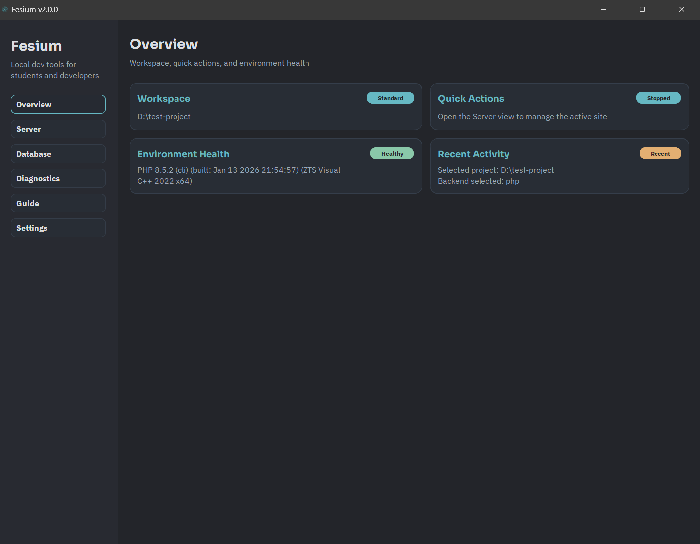

# Fesium

<p align="center">
  
</p>

**Local dev tools for students and developers.**

`Fesium` is the new direction of the original `NanoServer` project: a lightweight desktop app for serving local sites, inspecting SQLite databases, and keeping a student-friendly workflow fast, safe, and offline-first.

The repository is currently in a structured migration. The new `src/fesium/` package, modular core layer, bundled fonts, sidebar shell, and view system are already in place. The backend behavior is intentionally being preserved while the UI and repo contract are modernized.

## Current Scope

`Fesium` currently targets:

- local project selection from the desktop app
- Laravel-aware and standard project detection
- PHP-backed local serving when PHP is available
- static local serving fallback when PHP is unavailable
- opening the running local site in the default browser
- SQLite inspection with read-only defaults
- offline-first desktop usage
- a cleaner public-repo structure for ongoing iteration

This is the first app in a future local-toolbox direction, but the repo does not pretend to be a larger suite yet.

## Principles

- **Offline-first:** no runtime dependency on external assets or hosted services
- **Security-first defaults:** read-only SQLite mode, local-only server assumptions, explicit destructive-action handling
- **Student-friendly:** lightweight setup, clear diagnostics, minimal friction on school or restricted machines
- **Modular architecture:** runtime logic under `src/fesium/` instead of a single monolithic script

## Status

The `Fesium` migration is in progress. Right now the repository includes:

- packaged app bootstrap in `src/fesium/`
- separated core modules for config, server, database, environment, security, and project detection
- bundled local fonts for the approved `Graphite Grid` visual direction
- sidebar navigation and the first real views
- a larger default desktop shell with improved baseline readability
- responsive `Server` controls with a visible log panel at the default window size
- scroll-safe `Server`, `Database`, `Environment`, and `Settings` views
- refined inset panel surfaces for operational panels and logs
- root launchers for both the new `fesium.py` path and the temporary `nanoserver.py` compatibility shim

The old flat runtime modules have been removed. The only legacy bridge left at the repo root is `nanoserver.py`, which now forwards into the `Fesium` package for compatibility.

## Local Server Workflow

From the `Server` view, `Fesium` can:

- select a local project folder
- auto-detect Laravel projects or treat the folder as a standard site
- run the local site with PHP when PHP is available on your system
- fall back to a static local server when PHP is unavailable
- open the running local site in your browser
- keep the controls readable at the default desktop size
- keep the log panel visible without forcing immediate manual window resizing

SQLite support remains focused on inspection with read-only defaults in this milestone.

## Overview



## Requirements

- Python 3.8+
- PHP on your system `PATH` for PHP-backed serving

Check PHP availability:

```bash
php -v
```

## Installation

```bash
git clone https://github.com/goAuD/Fesium.git
cd Fesium
python -m pip install -r requirements.txt
```

## Running the App

Primary launcher:

```bash
python fesium.py
```

Temporary compatibility launcher:

```bash
python nanoserver.py
```

## Development

Install development dependencies:

```bash
python -m pip install -r requirements.txt
```

Run tests:

```bash
python -m pytest tests/unit -v
```

Run the full test suite:

```bash
python -m pytest -v
```

## Project Layout

```text
Fesium/
├── src/
│   └── fesium/
│       ├── app/
│       ├── core/
│       ├── ui/
│       └── assets/
├── tests/
├── docs/
├── fesium.py
└── nanoserver.py
```

## Origin

The project started as `NanoServer`, built as a free alternative for school environments where tools like Laragon were no longer a practical option. `Fesium` keeps that purpose, but gives it a stronger architecture, a better product shell, and a clearer long-term direction.

## Contributing

See [CONTRIBUTING.md](CONTRIBUTING.md) for setup, test commands, and repo conventions.

## License

The repository is licensed under the Apache License, Version 2.0.
