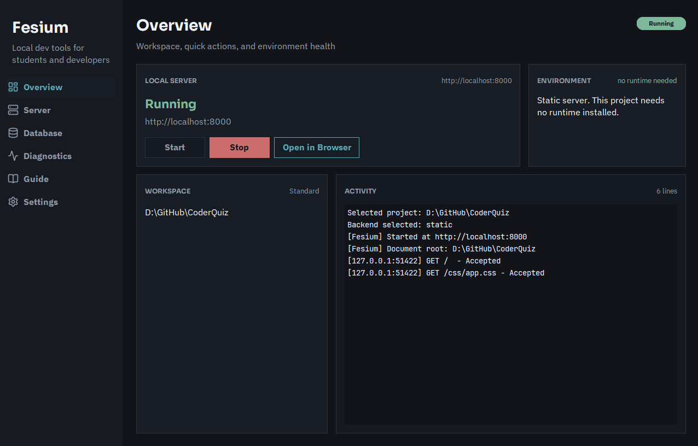
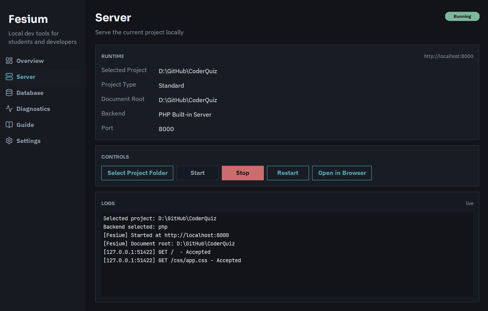

# Fesium

<p align="center">
  
</p>

**Local dev tools for students and developers.**

`Fesium` is the new direction of the original `NanoServer` project: a lightweight desktop app for serving local sites, inspecting SQLite databases, and keeping a student-friendly workflow fast, safe, and offline-first.

The repository is currently in a structured migration. The new `src/fesium/` package, modular core layer, bundled fonts, sidebar shell, and view system are already in place. The backend behavior is intentionally being preserved while the UI and repo contract are modernized.

## Current Scope

`Fesium` currently targets:

- local project selection from the desktop app
- Laravel-aware and standard project detection
- PHP-backed local serving when PHP is available
- static local hosting for plain HTML, CSS, and JavaScript projects
- static local serving fallback when PHP is unavailable
- opening the running local site in the default browser
- SQLite inspection and raw SQL execution with read-only defaults
- a readiness check for the database a project's own `.env` asks for
- lightweight SQLite schema browsing and table preview
- an in-app guide for students and first-time users
- stored preferences for the startup project and the default server port
- offline-first desktop usage
- a cleaner public-repo structure for ongoing iteration

This is the first app in a future local-toolbox direction, but the repo does not pretend to be a larger suite yet.

## Principles

- **Offline-first:** no runtime dependency on external assets or hosted services
- **Security-first defaults:** read-only SQLite mode, local-only server assumptions, explicit destructive-action handling
- **Student-friendly:** lightweight setup, clear diagnostics, minimal friction on school or restricted machines
- **Modular architecture:** runtime logic under `src/fesium/` instead of a single monolithic script

## Status

The `Fesium` migration is in progress. Right now the repository includes:

- packaged app bootstrap in `src/fesium/`
- separated core modules for config, server, database, environment, security, and project detection
- bundled local fonts for the approved `Graphite Grid` visual direction
- sidebar navigation and the first real views
- a larger default desktop shell with improved baseline readability
- responsive `Server` controls with a visible log panel at the default window size
- scroll-safe `Server`, `Database`, `Diagnostics`, `Guide`, and `Settings` views
- consistent bordered panel surfaces for operational panels and logs
- a recent-activity overview, clearer diagnostics, and a Settings view wired to real preferences
- a student-facing `Guide` page that frames static and PHP hosting as valid Fesium workflows
- a focused SQLite schema browser with table list, column inspect, and quick preview queries
- root launchers for both the new `fesium.py` path and the temporary `nanoserver.py` compatibility shim

The old flat runtime modules have been removed. The only legacy bridge left at the repo root is `nanoserver.py`, which now forwards into the `Fesium` package for compatibility.

## Local Server Workflow

From the `Server` view, `Fesium` can:

- select a local project folder
- auto-detect Laravel projects or treat the folder as a standard site
- run the local site with PHP when PHP is available on your system
- fall back to a static local server when PHP is unavailable
- open the running local site in your browser
- keep the controls readable at the default desktop size
- keep the log panel visible without forcing immediate manual window resizing

SQLite support remains focused on inspection with read-only defaults in this milestone.

## Database Workflow

From the `Database` view, `Fesium` can:

- use a project-detected SQLite database when one is available
- let you manually select a `.sqlite`, `.db`, or `.db3` file
- reset back to the detected project database
- browse detected tables in the active SQLite file
- inspect column names, types, nullability, and primary-key flags
- generate a quick `SELECT * LIMIT 100` preview for the selected table
- run one SQL statement at a time
- keep `Read-only` mode enabled by default on every launch
- require confirmation before destructive queries run in write mode

The database tooling is still intentionally SQLite-only and lightweight. It now includes a focused schema browser, but it does not try to be a full database IDE.

## Settings

From the `Settings` view, `Fesium` can:

- choose whether launching reopens your last project
- set a default project folder to fall back on
- set the default port for the local server, validated to the 1024-65535 range

Preferences live in `~/.fesium/config.json`. A folder that has been moved or deleted since the last launch is skipped rather than treated as an error, and the view states in one line which folder the next launch will open.

## Current UI Preview

`Overview` shows what is running, where, and what just happened, with the controls in the tile itself.



`Server` keeps the runtime facts compact so the live log gets the room.



Both are produced by `python scripts/capture_screenshots.py`, which grabs the window's client area directly. That keeps the colours exact - a snipping tool shifted every channel by about +17 and washed the whole palette out - and every image comes out the same size.

## Quickstart

```bash
git clone https://github.com/goAuD/Fesium.git
cd Fesium
python -m pip install -r requirements.txt
python fesium.py
```

Requires Python 3.10 or newer. Fesium serves your site. It does **not** run a database server: a project pointed at MySQL or PostgreSQL needs that service running separately, and the `Diagnostics` view says so before you open the site. SQLite needs nothing, because it is a file.

PHP on your `PATH` is optional - Fesium falls back to a built-in static server when PHP is unavailable.

Installing the package instead of running from the clone gives you a `fesium` command and `python -m fesium`:

```bash
python -m pip install -e .
fesium
```

Full install, launcher, and test instructions live in [docs/dev/setup.md](docs/dev/setup.md) and [docs/dev/testing.md](docs/dev/testing.md).

## Project Layout

```text
Fesium/
├── src/
│   └── fesium/
│       ├── app/
│       ├── core/
│       ├── ui/
│       └── assets/
├── tests/
├── docs/
├── fesium.py
└── nanoserver.py
```

## Origin

The project started as `NanoServer`, built as a free alternative for school environments where tools like Laragon were no longer a practical option. `Fesium` keeps that purpose, but gives it a stronger architecture, a better product shell, and a clearer long-term direction.

## Contributing

See [CONTRIBUTING.md](CONTRIBUTING.md) for the contributor entry point, and [docs/](docs/) for the full documentation tree (setup, testing, conventions, specs, plans, decisions, release notes).

## License

The repository is licensed under the Apache License, Version 2.0.
