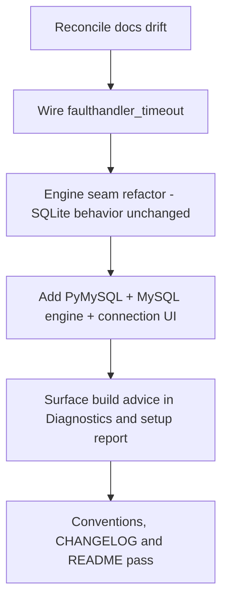

# Handoff Audit and Continuation Plan - 2026-08-23

Date: 2026-08-23
Status: Reviewed and adopted - the sequencing in Section 4 is the agreed plan; step 1 starts with this commit and the v2.2.0 baseline.
Scope: Independent verification of the 2026-08-23 handoff brief, an assessment of the agreed MySQL work (ADR 0002), and a recommended sequencing of next steps.

## Summary

The handoff brief is largely accurate. Every code-level claim it makes about post-tag hardening, the Setup Report, ADR 0002, and the `Open, not scheduled` roadmap items is confirmed in the repository, with file-and-line evidence. The brief is weakest exactly where it matters most for the next task: the "engine seam in the 188-line [`core/database.py`](src/fesium/core/database.py:1)" does not exist yet. It is a to-do on the roadmap, and [`database.py`](src/fesium/core/database.py:1) is SQLite-specific end to end. Three smaller discrepancies also surfaced: the ROADMAP marks the Pages site as shipped in v2.1.0 while CHANGELOG lists it as `Unreleased`; the `faulthandler_timeout` measure the ROADMAP relies on is not actually wired into the test invocation; and MySQL is still framed as a v2.3.0 item in the ROADMAP while the handoff elevates it to the next task.

## 1. Verified Claims

| # | Handoff claim | Verdict | Evidence |
| --- | --- | --- | --- |
| 1a | main is green and clean: 346 tests, 1 skip, ruff clean | Not verifiable from repo state | Test and lint are exercised only by CI; no shell access in this audit. The suite is extensive (see [`tests/`](tests/unit/)), and no `@pytest.mark.skip` decorators were found while one `pytest.importorskip` exists at [`test_width_agnostic_label.py`](tests/unit/ui/test_width_agnostic_label.py:159), consistent with a single conditional skip - but "346 tests, 1 skip" and "ruff clean" cannot be proven by reading files. |
| 1b | full CI matrix | Confirmed | [`python-tests.yml`](.github/workflows/python-tests.yml:53) runs `os: [ubuntu-latest, windows-latest, macos-latest]` x `python-version: ["3.10", "3.11", "3.12"]`; a dedicated `ruff` job sits at [`python-tests.yml`](.github/workflows/python-tests.yml:24). |
| 1c | live site serves fresh build | Partially confirmed | [`pages.yml`](.github/workflows/pages.yml:28) deploys `site/`, and [`test_site_contract.py`](tests/unit/test_site_contract.py:18) fails if the committed page and its generator disagree. Whether the live page is actually being served cannot be checked without network access. |
| 1d | PR #36 was the manuscript; no other open work | Not verifiable from repo state | GitHub-side facts (PRs, branches) are not in the working tree. |
| 2a | v2.1.0 is out with tag and GitHub Release | Partially confirmed | Version is `2.1.0` at [`_version.py`](src/fesium/_version.py:8); CHANGELOG carries `## [2.1.0] - 2026-08-22` at [`CHANGELOG.md`](CHANGELOG.md:46); release notes exist at [`docs/release/v2.1.0.md`](docs/release/v2.1.0.md:1). The tag and Release objects themselves are GitHub-side and not in the tree. |
| 2b | the site lives at goaud.github.io/Fesium | Partially confirmed | The repo slug `goAuD/Fesium` is asserted at [`semgrep.yml`](.github/workflows/semgrep.yml:31); Pages deploys `site/`. The exact URL is implied, not stated in-repo. |
| 3a | Setup Report: one-click pasteable diagnostics; home dir removed; passwords can never be included | Confirmed | Copy-to-clipboard wiring is tested at [`test_environment_view.py`](tests/unit/ui/test_environment_view.py:106); home redaction is [`redact_home`](src/fesium/core/setup_report.py:48); the printed type [`DatabaseRequirement`](src/fesium/core/project_database.py:26) has only `connection/host/port/database` fields; the report footer asserts "No passwords are included" at [`setup_report.py`](src/fesium/core/setup_report.py:223). |
| 3b | ADR 0002 - MySQL via own view + PyMySQL, not bundled admin panel | Confirmed | [`docs/decisions/0002-mysql-through-our-own-view.md`](docs/decisions/0002-mysql-through-our-own-view.md:21) chooses route B over PyMySQL. |
| 3c | Pages site generated from generator using app's own tokens | Confirmed | [`build_site.py`](scripts/build_site.py:31) imports `__version__` and [`build_site.py`](scripts/build_site.py:32) imports `COLOR_TOKENS` from `fesium.ui.theme.tokens`. |
| 3d | server hardening: dot-path routes blocked on both backends | Confirmed | Python side: [`is_hidden_path`](src/fesium/core/static_server.py:35) plus the guard at [`static_server.py`](src/fesium/core/static_server.py:98). PHP side: [`router.php`](src/fesium/assets/php/router.php:20) returns 403 for dot segments. |
| 3e | Host header checked | Confirmed | [`_host_names_this_server`](src/fesium/core/static_server.py:106), invoked from [`static_server.py`](src/fesium/core/static_server.py:95). |
| 3f | address fixed to 127.0.0.1 | Confirmed | `LOOPBACK = "127.0.0.1"` at [`server.py`](src/fesium/core/server.py:57); both servers bind it (PHP at [`server.py`](src/fesium/core/server.py:164), static at [`static_server.py`](src/fesium/core/static_server.py:186)). |
| 3g | PHP readiness awaited | Confirmed | [`wait_until_serving`](src/fesium/core/server.py:87) blocks until the port answers, called before success at [`server.py`](src/fesium/core/server.py:181). |
| 3h | ox-alpha review: all findings closed, documented in English | Confirmed | [`docs/reviews/ox-alpha-review-2026-08-23.md`](docs/reviews/ox-alpha-review-2026-08-23.md:3) states "every finding below is closed"; the done/checked list is at [`ox-alpha-review-2026-08-23.md`](docs/reviews/ox-alpha-review-2026-08-23.md:109). |
| 4a | ROADMAP "Open, not scheduled": macOS CI hangs item | Confirmed | [`ROADMAP.md`](ROADMAP.md:56) matches the brief: 3x on `macos-latest`, two causes fixed, third unreproduced, `timeout-minutes` + `faulthandler_timeout`, "do not disable a test on a guess". |
| 4b | ROADMAP item: surface build advice in Diagnostics and setup report | Confirmed | [`ROADMAP.md`](ROADMAP.md:57); [`node_project.py`](src/fesium/core/node_project.py:26) recognizes exactly 8 frameworks (SvelteKit, Next.js, Nuxt, Astro, Angular, CRA, Vue CLI, Vite); the advice today feeds only the no-index page via [`describe_node_project`](src/fesium/core/node_project.py:123), and [`setup_report.py`](src/fesium/core/setup_report.py:1) imports none of it. |
| 4c | ROADMAP item: `.well-known` question | Confirmed | [`ROADMAP.md`](ROADMAP.md:58). |
| 5 | Agreed next task: MySQL per ADR 0002, engine seam in the 188-line database.py | Partially confirmed / misleading | The plan and ADR exist, and [`database.py`](src/fesium/core/database.py:1) is indeed ~188 lines. But the "engine seam" is a roadmap to-do ([`ROADMAP.md`](ROADMAP.md:90)), not present code. See Section 2. |

## 2. MySQL Plan Assessment (ADR 0002)

### 2.1 Does `core/database.py` have a clean engine seam today?

No. The ADR's own framing undercounts the SQLite coupling. [`ADR 0002`](docs/decisions/0002-mysql-through-our-own-view.md:15) says "`sqlite3` appears in four places," but reading the file shows the SQLite-specific surface is larger:

- [`database.py`](src/fesium/core/database.py:13) - `import sqlite3`
- [`database.py`](src/fesium/core/database.py:68) - `self._connection: sqlite3.Connection | None`
- [`database.py`](src/fesium/core/database.py:85) - `sqlite3.connect(...)` in the connection context manager
- [`database.py`](src/fesium/core/database.py:86) - `conn.row_factory = sqlite3.Row`
- [`database.py`](src/fesium/core/database.py:111) - `os.path.exists(self.db_path)` file-existence guard (SQLite-only: a MySQL target is not a local file)
- [`database.py`](src/fesium/core/database.py:140) - `except sqlite3.Error`
- [`database.py`](src/fesium/core/database.py:157) - the `sqlite_master` table listing
- [`database.py`](src/fesium/core/database.py:175) - `pragma_table_info(?)` column lookup

The ADR's Decision correctly names the four *behaviors* to abstract (connect, list tables, describe columns, driver error type), but the seam must additionally cover the `db_path`/file-existence model and the `sqlite3.Connection` type hint. This is a refactor first, then a feature - not a feature into an existing seam.

The genuinely engine-neutral parts the ADR relies on are real: the read-only gate at [`database.py`](src/fesium/core/database.py:116), the risk classification from [`security.py`](src/fesium/core/security.py:1), the result shape at [`database.py`](src/fesium/core/database.py:127), and [`validate_table_name`](src/fesium/core/database.py:46).

### 2.2 What PyMySQL integration would touch

- **`core/database.py`** - introduce an engine boundary behind connect, list tables, describe columns, and error type; keep the read-only gate and result shape intact.
- **`core/project_database.py`** - today [`DatabaseRequirement`](src/fesium/core/project_database.py:26) carries no user or password, and a test pins that at [`test_setup_report.py`](tests/unit/core/test_setup_report.py:67). The MySQL work needs a *separate* credential-carrying structure, not new fields on `DatabaseRequirement`, or that safety-by-construction test breaks.
- **`ui/views/database_view.py`** - the view is hardcoded SQLite today: header "SQLite queries with explicit safety defaults" at [`database_view.py`](src/fesium/ui/views/database_view.py:199), a "Select Database File" button at [`database_view.py`](src/fesium/ui/views/database_view.py:258), and file-oriented source badges. It needs host/port/database/user/password fields for server-backed engines.
- **`app/controller.py` + `app/bootstrap.py`** - session credential entry, per-launch read-only and password reset, and connection state.
- **`requirements.txt` / `pyproject.toml`** - add `PyMySQL` (pinned in the former, ranged in the latter). It is absent from both today ([`requirements.txt`](requirements.txt:11), [`pyproject.toml`](pyproject.toml:14)).
- **`docs/dev/conventions.md`** - the ADR checklist item "credentials are never written to disk" is not yet stated as a standalone rule; the closest existing text is [`conventions.md`](docs/dev/conventions.md:39).

### 2.3 Dialect details the ADR leaves implicit

These are implementation-critical and not named in the ADR:

1. **Parameter placeholder style.** SQLite uses `?` (e.g. [`pragma_table_info(?)`](src/fesium/core/database.py:175)); PyMySQL uses `%s`. The engine must translate placeholders, or bound lookups will throw.
2. **Identifier quoting.** MySQL wants backticks for identifiers; SQLite accepts bare/`"` names. `validate_table_name`'s strict `^[a-zA-Z_][a-zA-Z0-9_]*$` at [`database.py`](src/fesium/core/database.py:43) is a safe, documented subset that sidesteps most quoting needs, but the preview query builder must not assume SQLite quoting.
3. **Read-only classification is SQLite-tuned.** [`is_read_query`](src/fesium/core/database.py:23) allows `SELECT/PRAGMA/EXPLAIN/WITH`. MySQL users will legitimately run `SHOW`, `DESCRIBE`, and `EXPLAIN`; `PRAGMA` is SQLite-only. Conversely, MySQL write statements outside the current keyword gate (`REPLACE`, `CALL proc()`, `GRANT`, `CREATE`, `RENAME`, `LOAD DATA`) must be classified as writes or the read-only default loses meaning on MySQL.
4. **Read-only is keyword-gated, not driver-enforced.** The "read-only default" is enforced only by [`is_read_query`](src/fesium/core/database.py:116) - the SQLite connection is not opened `mode=ro`. ADR 0002 keeps the same posture for MySQL, which is acceptable *if* the classification learns MySQL's write keywords; a `SET SESSION TRANSACTION READ ONLY` connection would be a cheap defense-in-depth addition, but it is not in the ADR.

### 2.4 Verdict

The direction is sound and well-argued (rejecting a bundled admin panel is consistent with the read-only-by-default guardrail). The plan is *under*-specified on the seam's real size and on MySQL dialect specifics, and it rests on a seam that does not exist yet. Recommendation: split the work into (a) an engine-seam refactor with no behavior change, proven by the existing suite, then (b) the PyMySQL engine and connection UI. This keeps "read-only default carried over" an observable invariant rather than a promise made mid-refactor.

## 3. Risks

| Risk | Severity | Notes |
| --- | --- | --- |
| Read-only parity for MySQL | High | The only enforcement is keyword classification ([`database.py`](src/fesium/core/database.py:116)). It must learn MySQL read verbs (`SHOW`, `DESCRIBE`) and write verbs (`REPLACE`, `CALL`, `GRANT`, `CREATE`, `RENAME`, `LOAD DATA`) or the default is trivially bypassed on MySQL. |
| Credential handling | High | Password per session, in memory, never written to disk. Must not extend [`DatabaseRequirement`](src/fesium/core/project_database.py:26) (test-pinned), must not reach logs or the setup report. A separate credential type plus a log/redaction test is required. |
| Dependency policy vs offline-first | Medium | PyMySQL is pure-Python/MIT (no compiler) - the right choice for locked-down machines. But it is a network-installed dependency for a product that must stay useful offline. Lazy-import it inside the MySQL engine so SQLite-only users never require it, and pin it in [`requirements.txt`](requirements.txt:1). |
| Placeholder and identifier dialects | Medium | `?` vs `%s` and backtick quoting must live behind the seam; otherwise bound lookups and preview queries break on MySQL. |
| Connection lifecycle / UI freeze | Medium | SQLite opens per query; MySQL needs a connect timeout and bounded query time in the pattern of [`wait_until_serving`](src/fesium/core/server.py:87) and the 0.75s DB probe at [`project_database.py`](src/fesium/core/project_database.py:23), or a slow host stalls the UI. |
| `validate_table_name` limits MySQL names | Low | The strict regex is safe; MySQL names with spaces/backticks will be refused. Acceptable if documented. |
| Test suite must stay socket-free | Medium | [`docs/dev/testing.md`](docs/dev/testing.md:3) requires a network-free suite; the ADR checklist demands seam tests that never open a socket - use a fake engine, not a live MySQL. |

## 4. Recommended Sequencing

1. **Reconcile the release state before starting MySQL.** The `[Unreleased]` block ([`CHANGELOG.md`](CHANGELOG.md:7)) holds the Setup Report, the Pages site, the server hardening, ADR 0002, and the review. Decide whether this lands as a v2.1.1/v2.2.0 release now, so MySQL starts from a clean tagged baseline. In the same pass, fix the ROADMAP/CHANGELOG disagreement over the Pages site: [`ROADMAP.md`](ROADMAP.md:50) marks it shipped in v2.1.0 while [`CHANGELOG.md`](CHANGELOG.md:42) lists it as Unreleased - and move the MySQL item out of the "v2.3.0" framing ([`ROADMAP.md`](ROADMAP.md:83)) to reflect its agreed next-task status.

2. **Wire `faulthandler_timeout` (or `--faulthandler-timeout`) into the test run.** The ROADMAP item at [`ROADMAP.md`](ROADMAP.md:56) relies on this to name the next macOS stall, but [`python-tests.yml`](.github/workflows/python-tests.yml:74) runs plain `pytest -v` and [`pyproject.toml`](pyproject.toml:40) has no such option. It is a one-line prerequisite that turns the next occurrence into evidence. Do not disable any test on speculation.

3. **Engine seam as its own change, no MySQL yet.** Refactor [`database.py`](src/fesium/core/database.py:1) behind an engine boundary covering connect, list tables, describe columns, error type, and the file-vs-server connection model. Prove it with the existing suite - behavior must not change. This de-risks step 4 by separating "rearrange" from "add an engine."

4. **MySQL engine + connection UI.** Add PyMySQL (pinned/ranged), the MySQL engine (placeholder + identifier handling, MySQL-aware read/write classification), per-session credentials held in memory only, per-launch read-only and password reset, and the connection fields in [`database_view.py`](src/fesium/ui/views/database_view.py:146). Tests use a fake engine, never a socket.

5. **Surface the build advice** (ROADMAP item b, [`ROADMAP.md`](ROADMAP.md:57)): route [`describe_node_project`](src/fesium/core/node_project.py:123) into [`setup_report.py`](src/fesium/core/setup_report.py:1) and the Diagnostics screen. Independent and low-risk; it also touches `setup_report.py`, so doing it after step 4 avoids double-editing the same file.

6. **Docs pass.** Add the "credentials never written to disk" rule to [`conventions.md`](docs/dev/conventions.md:1), then update CHANGELOG and README to match the shipped behavior.

## 5. Gaps the Handoff Missed

- **The engine seam does not exist.** The brief phrases it as present ("engine seam in the 188-line [`core/database.py`](src/fesium/core/database.py:1)"); it is a roadmap to-do and the file is fully SQLite-bound (Section 2.1).
- **`faulthandler_timeout` is not wired in.** The ROADMAP's remedy for the next macOS hang is described but absent from both the workflow and pytest config.
- **Placeholder/identifier dialect differences** (`?` vs `%s`, backticks) are unaddressed in ADR 0002 and are the most likely source of a silent MySQL breakage.
- **Read-only classification is SQLite-tuned.** MySQL read verbs (`SHOW`, `DESCRIBE`) and write verbs (`REPLACE`, `CALL`, `GRANT`, `CREATE`, `RENAME`, `LOAD DATA`) are not in the current gate.
- **The setup-report credential test is a hard constraint.** Extending [`DatabaseRequirement`](src/fesium/core/project_database.py:26) with user/password fields would break [`test_setup_report.py`](tests/unit/core/test_setup_report.py:67); the design needs a separate credential type.
- **Username pre-fill is ambiguous.** ADR 0002 says "pre-fill every field except the one that matters" ([`0002`](docs/decisions/0002-mysql-through-our-own-view.md:26)), which could read as pre-filling `DB_USERNAME`, while [`ROADMAP.md`](ROADMAP.md:91) says "credentials excluded." Decide and document whether the username is a credential.
- **Docs drift.** ROADMAP claims the Pages site shipped in v2.1.0 while CHANGELOG lists it as Unreleased, and ROADMAP still frames MySQL as v2.3.0 even though it is now the agreed next task.
